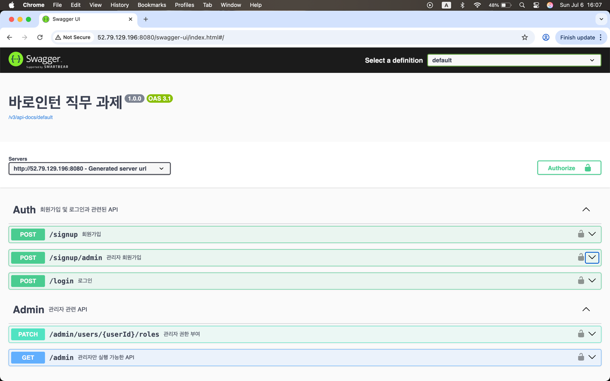

# 바로인턴 백엔드 과제 - Spring Boot JWT Auth API

Spring Boot 기반의 JWT 인증/인가 구현 프로젝트입니다.  
AWS EC2에 배포되어 실제 클라우드 환경에서 동작 중이며, Swagger UI를 통해 API 명세를 확인할 수 있습니다.

---

## 🔗 프로젝트 개요
**주요 기능:**
- 회원가입 / 로그인
- JWT 기반 인증
- Role 기반 접근 제어
- 관리자 권한 부여

**기술 스택:**
- Spring Boot
- Spring Security
- JWT
- AWS EC2
- Swagger

---

## ✅ 배포 환경

- **언어**: Java 17
- **프레임워크**: Spring Boot 3.x
- **빌드 도구**: Gradle
- **인증 방식**: JWT (JSON Web Token)
- **서버**: AWS EC2 
- **배포 방식**: JAR 파일을 EC2에 직접 업로드하여 실행 (`java -jar`)

---

## 📂프로젝트 실행 방법

**1️⃣프로젝트 클론**
```
git clone https://github.com/heesoohi/springboot-jwt-auth-api.git
```

**2️⃣필수 환경 변수 설정**
- 인텔리제이 환경 변수 편집에서 ${JWT_SECRET_KEY} 환경변수 설정 (JWT 토큰 서명에 사용되는 암호키)
- 혹은 개인 환경에 맞추어 해당 환경 변수 설정

**3️⃣프로젝트 실행**

---

## 📄 API 명세
API 명세는 Swagger UI를 통해 확인 가능합니다.
- **Swagger UI 주소**:  
  [http://52.79.129.196:8080/swagger-ui/index.html](http://52.79.129.196:8080/swagger-ui/index.html)


---